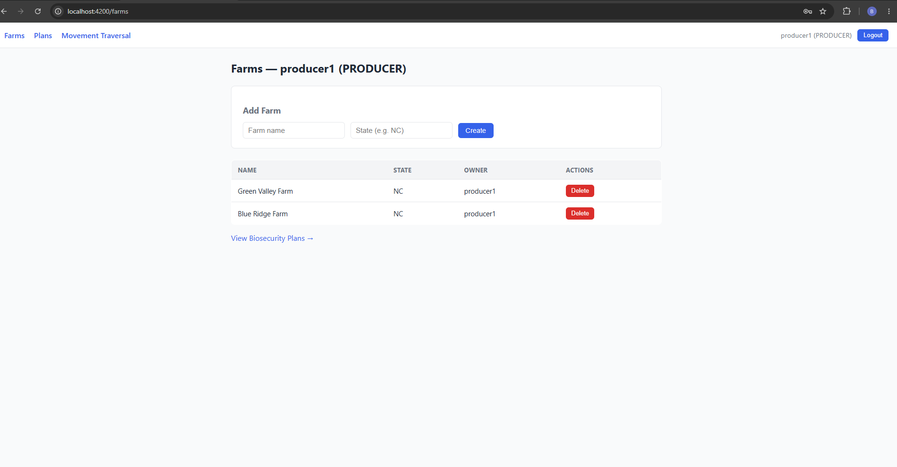
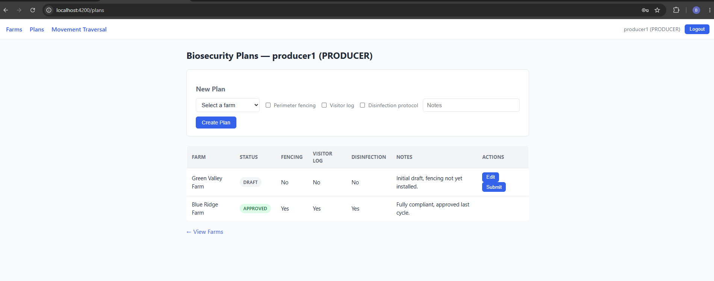
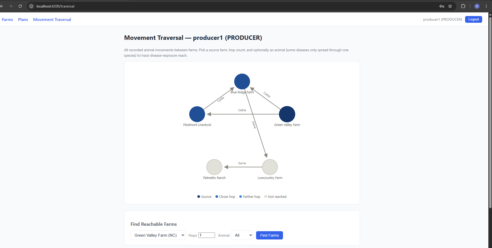

# Farm Management System

Full-stack biosecurity plan tracking and animal movement traceability system for farms, with role-based access for producers, reviewers, and state officials.



## What it does

- Producers register farms and submit biosecurity plans (fencing, visitor logs, disinfection protocols) for review
- Reviewers approve or reject submitted plans
- State officials get read-only visibility into farms/plans within their own state
- Movement records track animal shipments between farms, with a graph traversal query to find every farm reachable within N hops of a source farm — used to trace disease-exposure reach along the movement network
- Metrics exported from the backend and visualized on Grafana dashboards backed by Prometheus

## Screenshots

| Farms | Biosecurity Plans |
|---|---|
|  |  |

**Movement traversal graph** — BFS over the farm-to-farm movement network, highlighting farms reachable within a chosen hop count and animal species:



## Stack

- **Backend**: Spring Boot 4.1 (Java 17, Maven), Spring Security + JWT, Spring Data JPA, H2 (in-memory)
- **Frontend**: Angular 21 (standalone components, zoneless), plain CSS
- **Monitoring**: Prometheus + Grafana (Docker Compose), scraping Spring Boot Actuator metrics

## Key features

- **JWT authentication & role-based authorization** — stateless auth (`PRODUCER`, `REVIEWER`, `STATE_OFFICIAL` roles), see `ARCHITECTURE.md` for the full login → token → request-validation flow
- **Biosecurity plan workflow** — draft → submit → approve/reject, enforced server-side by role
- **Movement graph traversal** — `GET /api/movements/traversal` runs a BFS from a source farm out to N hops, optionally filtered by animal species, rendered as an interactive graph on the frontend
- **Observability** — Dockerized Prometheus/Grafana stack scraping live backend metrics

## API overview

| Endpoint | Methods | Purpose |
|---|---|---|
| `/api/auth/login` | POST | Authenticate, receive JWT |
| `/api/farms` | GET, POST | List / register farms |
| `/api/farms/{id}` | GET, PUT, DELETE | Farm detail, update, delete |
| `/api/plans` | GET, POST | List / draft biosecurity plans |
| `/api/plans/{id}` | PUT | Edit a draft plan |
| `/api/plans/{id}/submit` | POST | Submit for review |
| `/api/plans/{id}/approve` | POST | Reviewer approves |
| `/api/plans/{id}/reject` | POST | Reviewer rejects |
| `/api/movements` | GET | List movement records |
| `/api/movements/traversal` | GET | N-hop reachability from a source farm |

## Running locally

**Backend** (port 8080):

```bash
cd backend
./mvnw spring-boot:run
```

Seeds a fresh set of demo users on every boot (printed to console), e.g. `producer1` / `password123`. H2 console at `http://localhost:8080/h2-console` (JDBC URL `jdbc:h2:mem:farmdb`).

**Frontend** (port 4200):

```bash
cd frontend
npm install
npm start
```

Open `http://localhost:4200` and log in with any seeded user.

**Monitoring** (optional — Prometheus on 9090, Grafana on 3000):

```bash
cd monitoring
docker compose up
```

## Architecture

See `ARCHITECTURE.md` for the JWT auth flow (login → token issuance → request validation → role enforcement).
